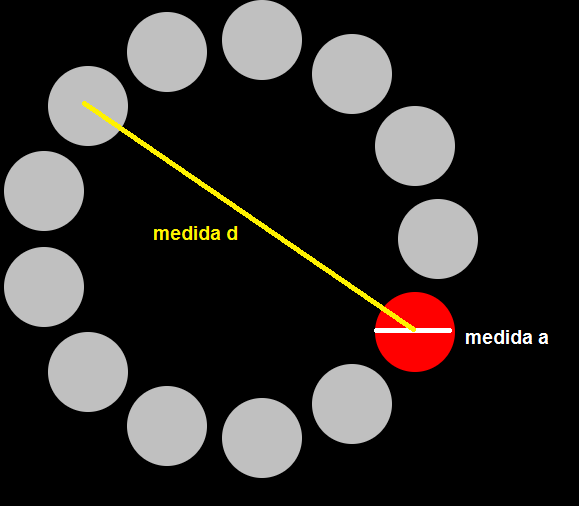

# Protocolo Fitts WeTech

## Log de tarefas:

- [x] 1: Verificar se o clique foi um acerto, erro (erro circulo errado, erro clique fora dos circulos).

- [x] 2: Log de acertos e erros com seus repectivos tempos.
(deve contar o numero de acerto, erro, o tempo de cada erro e acerto.)

- [x] 3: Implementar a sequencia 'extremo-oposto' para quando o números de círculos for par, ver função controleAlvos(indice) do script.js.

- [x] 4: Configuração do diamtro do alvo (A) e diametro da área (D), ver imagem 1.

- [ ] 5: Som de feedback do erro e acerto.

- [ ] 6: Processar o Log de Acertos e Erros para gerar um tabela com os resultados.

- [ ] 7: Baixar, Exportar a tabela de resultados.
 (JQuery tem um opção de importar um table em html para um excel)
 (Outra opção é printar o JSON com resultado e usar um conversor: http://www.convertcsv.com/json-to-csv.htm)

- [ ] 8: Centralizar a janela do teste.

- [ ] 9: Estilizar o menu de configuração.

(imagem 1)

## Configurações sugeridas
D = 100, 300

A = 30, 60, 100

Q = 13

Quantidade de fases do teste: nD * nA

Formato do resultado (resultados exemplos)

TM = Tempo Médio

| Fase            | Acertos | Acertos % | TM Acertos | Erros | Erros % | TM Erros | TM |
| --------------- | ------- | --------- | ------------------- | ----- | ------- | ----------------- | ----------- |
| A=30, D=100     | 10      | 90%       | 1300ms              | 3     | 10%     | 1400ms            | 3400ms |
| A=30, D=300     | 10      | 90%       | 1600ms              | 3     | 10%     | 1200ms            | 2420ms |
| A=60, D=100     | 9       | 87%       | 2300ms              | 4     | 13%     | 1300ms            | 5400ms |
| A=60, D=300     | 11      | 93%       | 1530ms              | 2     | 7%      | 1600ms            | 2400ms |
| A=100, D=100    | 12      | 98%       | 2900ms              | 1     | 2%      | 2400ms            | 3400ms |
| A=100, D=300    | 8       | 70%       | 5600ms              | 5     | 30%     | 3400ms            | 3200ms |
